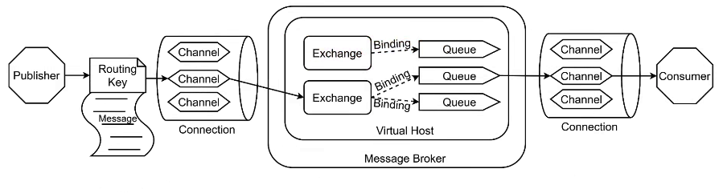
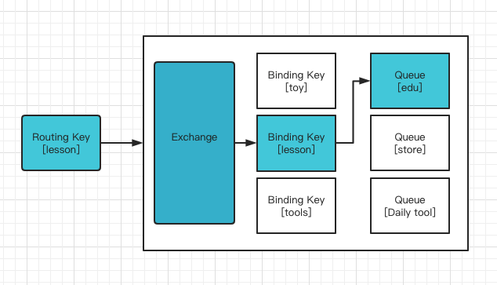
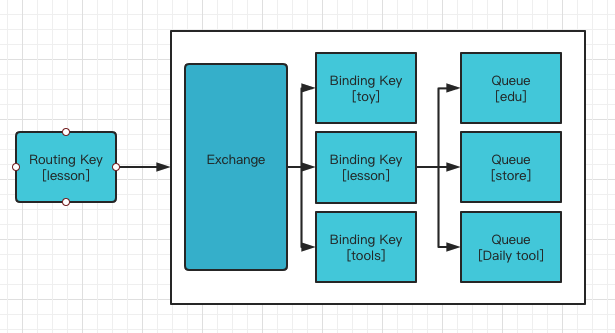
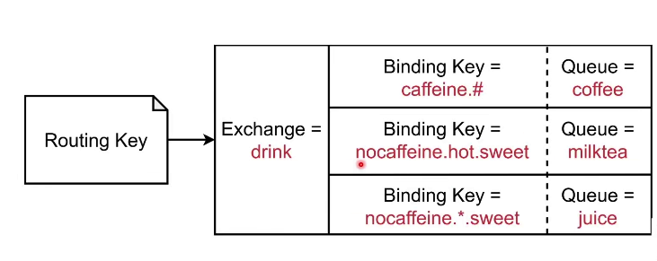

# AMQP协议

## 简介

Advanced Message Queuing Protocol 

RabbitMQ was originally developed to support AMQP which is the "core" protocol supported by the RabbitMQ broker. AMQP assigned port number is 5672 or 5671 for AMQPS (TLS/SSL encrypted AMQP).

- Broker

  接收和分发消息的应用，如：RabbitMQ就是一个 Message Broker

- Virtual Host

  虚拟Broker,多个隔离的单元

- Connection

  Publisher/Consumer 和 Broker的物理 TCP 连接

- Channel

  connection内部的逻辑连接，通常每个线程创建一个单独的Channel链接

- Routing Key 

  路由键，用于指示消息的路由转发，类似Handler的target

- Exchange

  交换机，负责去分发Message到不同的Queue

- Queue

  消息队列，消息最终被发送到这里，等待Consumer去消费

- Binding

  exchange和Queue之间的虚拟连接，用于message分发给Queue的依据

## Exchange

Exchange是AMQP协议，也是RabbitMQ的核心组件

它通过**Binding**以及**Routing Key**为消息提供路由，把消息转发至相应的队列

几种类型：

- Direct
- Topic
- Fanout
- Headers

比较常用的是前面三种类型Exchange

### Direct

**规则：**

Message中的Routing Key 如果和Binding Key 一致，Direct Exchange 则将Message发送到对应的Queue中去

即：`Routing Key  == Binding Key` ,否则丢弃消息

### Fanout Exchange 扇形展开

Message会被发送到每一个绑定的Queue中去

就类似是一个Boardcast广播的样子

### Topic Exchange

依据Routing Key以及**通配规则**，分发到目标Queue中

- 全匹配 :  与Dircet一致
- Binding Key - `#`    :  匹配任意个数的word
- Binding Key - `*`   :   匹配任意一个word

eg: 列举几个Routing Key

-   `nocaffeine.hot.sweet`

  那么它可以被发送到：

  nocaffeine.hot.sweet ->   miktea     完全匹配

  nocaffeine.*.sweet   -> juice     * 可以匹配一个单词，符合hot

- `nocaffeine.cold.sweet`

  nocaffeine.*.sweet   -> juice     * 可以匹配一个单词，符合hot

- `caffeine.hot.sweet`

  caffeine.#  ->  coffee

> [RabbitMQ Simulator (tryrabbitmq.com)](http://tryrabbitmq.com/)

